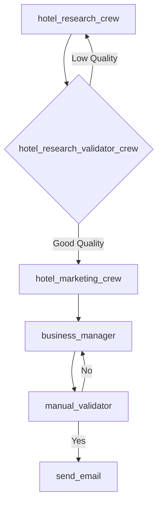

# 🏨 Hotel Proposer – AI Agent System for Hotel Outreach

**Non-commercial side project exploring AI-native agent design using [CrewAI](https://docs.crewai.com/) and [LangGraph](https://docs.langgraph.dev/)**

---

## 💡 Project Goal

Design an AI agent system to research hotels in Switzerland, prepare personalized outreach, validate proposals, and send emails — **entirely via agent-based orchestration**.

The project is not about building a faster way to script emails. Instead, it's an exploration into **LLM-first patterns**, where agents collaborate, share state, and make autonomous decisions.

---

## ⚙️ Tech Stack

- **[CrewAI](https://docs.crewai.com/)** – Define agents and their roles/tasks  
- **[LangGraph](https://docs.langgraph.dev/)** – Flow logic, state passing, retries, and validation  
- **Python** – Main codebase  
- **OpenAI API** – Language model backend  

---

## 🧠 Architecture Overview

### 👥 Crews

To handle complexity, agents are grouped into logical **crews**:

- **Researching Crew** – Finds and validates hotels
- **Marketing Crew** – Crafts outreach messages
- **Business Managers Crew** – Finalizes and approves emails

---

### 🔁 LangGraph Agent Flow

