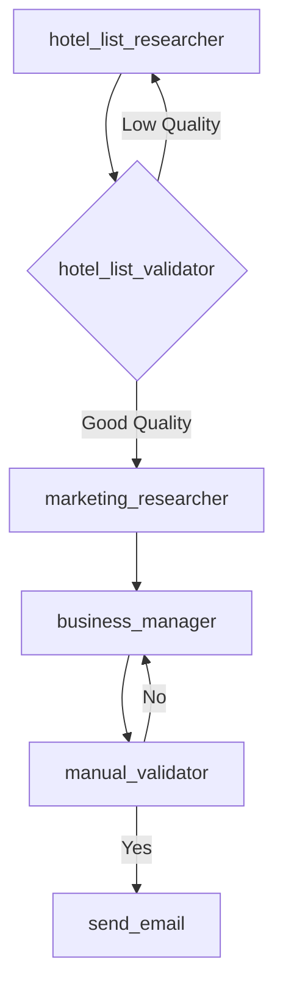

```mermaid
flowchart TD
    A["hotel_list_researcher"] --> B{"hotel_list_validator"}
    B -- Low Quality --> A
    B -- Good Quality --> D["marketing_researcher"]
    D --> F["business_manager"]
    F --> H["manual_validator"]
    H -- No --> F
    H -- Yes --> J["send_email"]

```

# hotel-proposer
