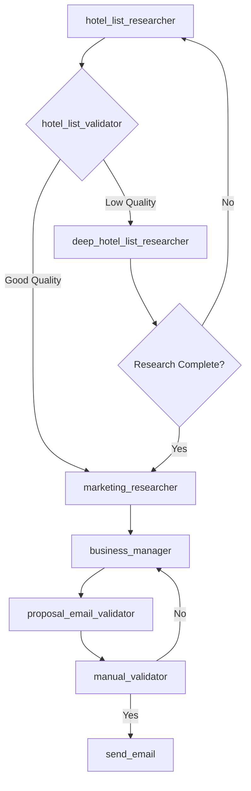

```mermaid
graph TD
    A[hotel_list_researcher] --> B{hotel_list_validator}
    B -->|Low Quality| C[deep_hotel_list_researcher]
    B -->|Good Quality| D[marketing_researcher]
    C --> E{Research Complete?}
    E -->|No| A
    E -->|Yes| D
    D --> F[business_manager]
    F --> G[proposal_email_validator]
    G --> H[manual_validator]
    H --> |No|F
    H --> |Yes|J[send_email]
```

# hotel-proposer
